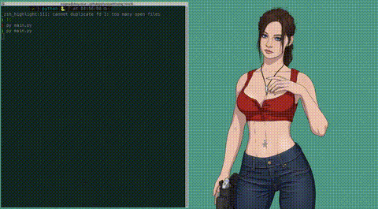

# 🛤️ Multi-Agent Pathfinding Simulator: Dijkstra vs. A*

A high-fidelity interactive simulation and visualization platform designed in Python to compare the **Dijkstra** and **A\* (Heuristic-Guided)** pathfinding algorithms on a 20x20 grid under various obstacle configurations.

The simulator tracks independent agents in real-time, animates their search space exploration process, overlays the final optimal paths, and displays direct performance comparisons using key metrics like **Path Length** and **Visited (Explored) Tiles count**.

---

## 📹 Visual Demonstration

Below is a live showcase of the simulator comparing the uninformed, radial expansion of Dijkstra vs. the targeted, heuristic-driven search of A*:

<p align="center">
  
</p>

---

## 🚀 Key Features

* **🎮 Interactive Agent Placement**: Double-agent capability where the user clicks directly on the Pygame grid to dynamically position Start and Goal nodes for **Agent 1** and **Agent 2**.
* **🎲 Dynamic Obstacle Scenarios**:
  - **Fixed Layout**: A pre-designed maze-like wall configuration to test intricate detours.
  - **Random Generator**: Configurable random density (minimum 40 obstacles) generated on the fly.
* **✨ Search Space Animation**: Step-by-step visual propagation showing how each algorithm explores the grid before establishing the shortest path.
* **📊 Live Performance Dashboard**: Premium in-window stats card comparing total steps taken (path length) vs. total search space complexity (visited tiles) for both algorithms.
* **🎵 Immersive Multimedia**: Integrated high-fidelity ambient background audio and UI soundscapes powered by Pygame Mixer.

---

## 🧮 Theoretical & Metric Comparison

The primary distinction between Dijkstra and A\* lies in **informed search** vs. **uninformed search**. The simulator exposes this difference clearly through the **Tiles Explored** metric.

### 1. Dijkstra's Algorithm (Uninformed)
Dijkstra's algorithm searches uniformly outwards in all directions. Because it does not know where the goal is located relative to its current state, it expands equally along all frontiers until it happens to intersect with the goal.
* **Distance Update Formula**:
  $$\text{dist}(v) = \min(\text{dist}(v), \text{dist}(u) + \text{weight}(u, v))$$
* **Behavior**: Radial, "ripple-effect" propagation. Guarantees the shortest path, but at high computational cost (high search space exploration).

### 2. A* Algorithm (Heuristic-Guided)
A\* improves upon Dijkstra by incorporating a heuristic function to guide its search. It uses the **Manhattan Distance** (for grid-based movements) to estimate the remaining distance to the goal.
* **Cost Function**:
  $$f(n) = g(n) + h(n)$$
  * $g(n)$: Actual cost to reach node $n$ from the starting node.
  * $h(n)$: Estimated cost from node $n$ to the goal. In our grid:
    $$h(n) = |x_n - x_{\text{goal}}| + |y_n - y_{\text{goal}}|$$
* **Behavior**: Goal-oriented beam search. Far fewer visited tiles because it prioritizes expanding nodes that lie directly in the direction of the goal.

### 📈 Metrics Showcase

| Metric | Dijkstra | A* (Heuristic-Guided) |
| :--- | :--- | :--- |
| **Optimality** | Guarantees shortest path | Guarantees shortest path (with admissible heuristic) |
| **Search Space** | Large (radial expansion) | Extremely small (focused corridor) |
| **Visited Tiles** | High (often 200+ tiles on 20x20 grid) | Extremely Low (typically 30 - 80 tiles) |
| **Compute Overhead** | Moderate | Low (prunes unnecessary paths) |

---

## 🎨 Visual Legend

The simulator utilizes a modern, cohesive UI color palette for ease of analysis:

| Tile Type | Visual Legend / Color | Description | Asset (img/) |
| :--- | :--- | :--- | :--- |
| **Floor** | Soft Off-white `(245, 245, 247)` | Clear, walkable grid tiles. | [floor.png](img/floor.png) |
| **Obstacle** | Dark Charcoal `(44, 44, 46)` | Impassable grid walls. | [obstacle.png](img/obstacle.png) |
| **Agent 1 Start** | Emerald Green `(34, 197, 94)` | Starting point for Agent 1. | [agent.png](img/agent.png) |
| **Agent 1 Goal** | Coral Red `(239, 68, 68)` | Goal point for Agent 1. | [goal.png](img/goal.png) |
| **Agent 2 Start** | Forest Green `(22, 163, 74)` | Starting point for Agent 2. | [agent2.png](img/agent2.png) |
| **Agent 2 Goal** | Ocean Blue `(59, 130, 246)` | Goal point for Agent 2. | [goal.png](img/goal.png) |
| **Agent 1 Explored** | Pastel Soft Pink `(254, 226, 226)` | Tiles visited only by Agent 1's search. | [path.png](img/path.png) |
| **Agent 2 Explored** | Pastel Soft Blue `(219, 234, 254)` | Tiles visited only by Agent 2's search. | [path2.png](img/path2.png) |
| **Shared Explored** | Pastel Lavender `(243, 232, 255)` | Tiles visited by both agents. | [path_both.png](img/path_both.png) |
| **Optimal Path 1** | Vibrant Cherry Red Line | Final shortest path for Agent 1. | Overlaid Line |
| **Optimal Path 2** | Vibrant Royal Blue Line | Final shortest path for Agent 2. | Overlaid Line |

---

## 🛠️ Installation & Setup

### Prerequisites
Make sure you have **Python 3.8+** installed.

### Dependencies
Install the required packages using pip:
```bash
pip install pygame customtkinter
```

### Cloning and Execution
1. Clone or download the repository:
   ```bash
   git clone https://github.com/EnigmaK9/pathfinding.git
   cd pathfinding
   ```
2. Launch the application:
   ```bash
   python main.py
   ```

---

## 🕹️ How to Use

1. **Configure Simulation**:
   - Choose **Fixed** or **Random** obstacles in the initial CustomTkinter dialog.
   - For random mode, input your desired obstacle count (Minimum: 40).
   - Click **Continue to Placement**.
2. **Interactive Node Placement**:
   - In the Pygame screen, place the start/goal nodes in the following order:
     1. Click to place **Agent 1 Start** (Green circle).
     2. Click to place **Agent 1 Goal** (Red circle).
     3. Click to place **Agent 2 Start** (Dark Green circle).
     4. Click to place **Agent 2 Goal** (Blue circle).
3. **Analyze Live Execution**:
   - Observe the step-by-step path exploration animation.
   - Review the metrics card at the bottom of the window.
4. **Repeat or Exit**:
   - Press **`R`** to reset the simulation, return to the configuration window, and generate a new test.
   - Press **`ESC`** or close the window to exit the application.

---

## ⚙️ Software Architecture

The project has been modularized to adhere to standard software design principles:

* **`main.py`** *(Facade Pattern)*: Orchestrates the overall execution flow.
* **`obstacles.py`** *(Factory Pattern)*: Decouples obstacle generation logic (fixed vs. random).
* **`pathfinding.py`** *(Strategy Pattern)*: Encapsulates algorithm behaviors enabling drop-in pathfinding replacement.
* **`visualization.py`** *(Template Method)*: Handles Pygame windows, inputs, grid draws, BGM audio, and live performance metrics display.
* **`input_data.py`** *(Builder Pattern)*: Configures the starting settings through CustomTkinter.
* **`utils.py`**: Holds shared grid operations, mathematical heuristics, and path backtracking logic.

---

## 📄 License

Licensed under the MIT License.

## 👤 Author

**EnigmaK9** (enigmak9@protonmail.com)
