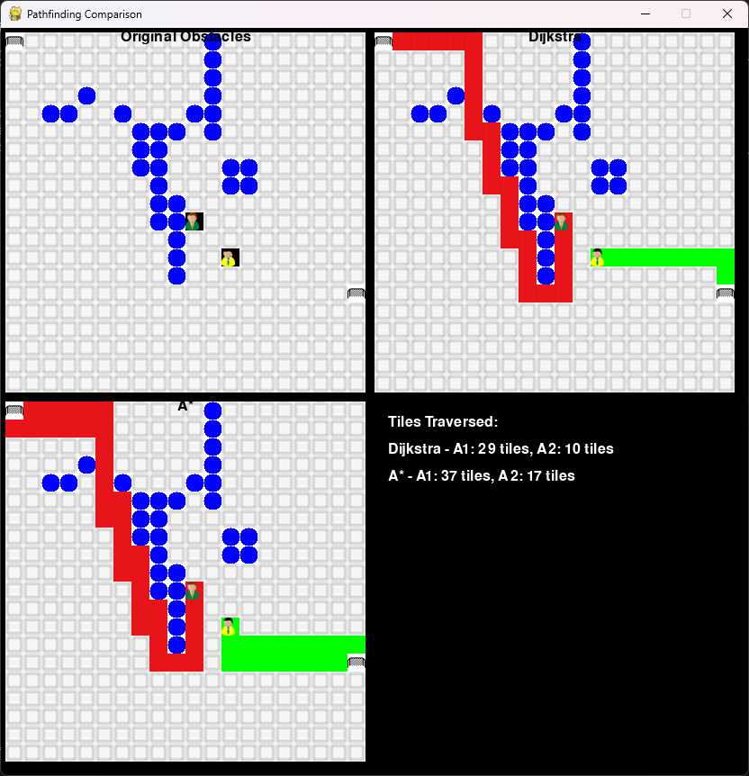
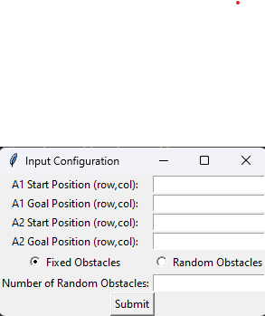

# Pathfinding

<a href="https://youtu.be/p9O71hcsSQc">Video del proyecto</a>

This program solves the pathfinding problem for a 20x20 grid with at least 40 obstacle cells. The program receives as input the initial position of two agents, A1 and A2, and finds the shortest path for each to reach their destination. The choice of the pathfinding algorithm is left to the student, as well as the programming language to be used and the mode of visualization (graphical or console).

## Step 1

Initialize the 20x20 cell grid, with a value of 0 in each cell.

## Step 2

Generate at least 40 obstacle cells randomly or fixed in the map and mark them with the value 1.

## Step 3

Receive as input the initial position of two agents, A1 and A2, and also the final positions for each.

## Step 4

Initialize the initial positions of A1 and A2 in the map with distinct values (for example, 2 for A1 and 3 for A2).

## Step 5

Choose a pathfinding algorithm (like A\*, Dijkstra, BFS, etc.) and apply it to find the shortest path for each agent from their initial position to their destination.

## Step 6

Store the paths found for A1 and A2.

## Step 7

Visualize the paths found on the map, either in a graphical interface or in the console.

## Screenshots

### Pathfinding Results

### GUI to Insert Data

