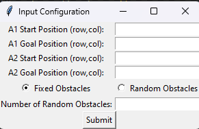

# Pathfinding Algorithms Comparison

This project demonstrates the comparison between Dijkstra and A\* algorithms for pathfinding in a 20x20 grid environment. The comparison is made for both fixed and random obstacles.

## Installation

To run this project, you need to have Python installed along with the following libraries:

- `pygame`
- `tkinter`

You can install these libraries using pip:

```bash
pip install pygame
```


## Usage

1. **Initialize Pygame**: Make sure Pygame is installed and properly configured.
2. **Run the Script**: Execute the script to start the Tkinter input configuration window where you can specify the start and goal positions for two agents (A1 and A2), and choose between fixed or random obstacles.

```bash
python pathfinding_comparison.py
```

## Functionality

### Matrix Creation

The project allows for two types of obstacle matrices:

- **Fixed Obstacles**: Predefined obstacles in specific positions.
- **Random Obstacles**: Randomly generated obstacles based on user input.

### Pathfinding Algorithms

The project uses two pathfinding algorithms:

- **Dijkstra**: Finds the shortest path from the start to the goal position without considering heuristics.
- **A\***: Uses heuristics (Manhattan distance) to find the shortest path more efficiently.

### Visualization

The project visualizes the matrices and paths using Pygame, displaying:

- Fixed Obstacles
- Random Obstacles
- Fixed Obstacles with paths found by Dijkstra and A\*
- Random Obstacles with paths found by Dijkstra and A\*

## Algorithms

### Dijkstra's Algorithm

Dijkstra's algorithm is implemented to find the shortest path in a grid. It uses a priority queue to explore the neighboring cells and updates the shortest distance found so far.

### A\* Algorithm

A\* algorithm combines the features of Dijkstra's algorithm and a heuristic to improve the search. It uses the Manhattan distance as the heuristic function:

$$
h(x) = |x_1 - x_2| + |y_1 - y_2|
$$

## Functions and Classes

- **create_random_obstacles(matrix, num_obstacles)**: Adds random obstacles to the matrix.
- **create_fixed_obstacles(matrix)**: Adds fixed obstacles to the matrix.
- **neighbors(matrix, current)**: Returns a list of neighboring cells.
- **Dijkstra(matrix, start, goal)**: Implements Dijkstra's algorithm.
- **A_star(matrix, start, goal)**: Implements A\* algorithm.
- **get_path(matrix, current, g_cost, start)**: Reconstructs the path from start to goal.
- **draw_all_matrices()**: Draws all matrices and paths using Pygame.
- **get_input_data()**: Collects input data from the user using Tkinter.
- **show_results()**: Displays the results of the pathfinding algorithms in a Tkinter window.

## Results

The results of the pathfinding algorithms are displayed in a Tkinter window, showing the path lengths for each scenario:

# Pathfinding Algorithms Comparison

This project demonstrates the comparison between Dijkstra and A* algorithms for pathfinding in a 20x20 grid environment. The comparison is made for both fixed and random obstacles.

## Installation

To run this project, you need to have Python installed along with the following libraries:
- `pygame`
- `tkinter`

You can install these libraries using pip:

```bash
pip install pygame


## Usage

1. **Initialize Pygame**: Make sure Pygame is installed and properly configured.
2. **Run the Script**: Execute the script to start the Tkinter input configuration window where you can specify the start and goal positions for two agents (A1 and A2), and choose between fixed or random obstacles.

```bash
python pathfinding_comparison.py


## Functionality

### Matrix Creation

The project allows for two types of obstacle matrices:
- **Fixed Obstacles**: Predefined obstacles in specific positions.
- **Random Obstacles**: Randomly generated obstacles based on user input.

### Pathfinding Algorithms

The project uses two pathfinding algorithms:
- **Dijkstra**: Finds the shortest path from the start to the goal position without considering heuristics.
- **A\***: Uses heuristics (Manhattan distance) to find the shortest path more efficiently.

### Visualization

The project visualizes the matrices and paths using Pygame, displaying:
- Fixed Obstacles
- Random Obstacles
- Fixed Obstacles with paths found by Dijkstra and A\*
- Random Obstacles with paths found by Dijkstra and A\*

### Screenshots

Here are some screenshots of the application in action:




## Algorithms

### Dijkstra's Algorithm

Dijkstra's algorithm is implemented to find the shortest path in a grid. It uses a priority queue to explore the neighboring cells and updates the shortest distance found so far.

### A* Algorithm

A* algorithm combines the features of Dijkstra's algorithm and a heuristic to improve the search. It uses the Manhattan distance as the heuristic function:

$$
h(x) = |x_1 - x_2| + |y_1 - y_2|
$$

## Functions and Classes

- **create_random_obstacles(matrix, num_obstacles)**: Adds random obstacles to the matrix.
- **create_fixed_obstacles(matrix)**: Adds fixed obstacles to the matrix.
- **neighbors(matrix, current)**: Returns a list of neighboring cells.
- **Dijkstra(matrix, start, goal)**: Implements Dijkstra's algorithm.
- **A_star(matrix, start, goal)**: Implements A* algorithm.
- **get_path(matrix, current, g_cost, start)**: Reconstructs the path from start to goal.
- **draw_all_matrices()**: Draws all matrices and paths using Pygame.
- **get_input_data()**: Collects input data from the user using Tkinter.
- **show_results()**: Displays the results of the pathfinding algorithms in a Tkinter window.

## Results

The results of the pathfinding algorithms are displayed in a Tkinter window, showing the path lengths for each scenario:

$$
\begin{align*}
\text{Fixed Obstacles Dijkstra - A1 Path Length:} & \, \text{path\_length} \\
\text{Fixed Obstacles Dijkstra - A2 Path Length:} & \, \text{path\_length} \\
\text{Fixed Obstacles A* - A1 Path Length:} & \, \text{path\_length} \\
\text{Fixed Obstacles A* - A2 Path Length:} & \, \text{path\_length} \\
\text{Random Obstacles Dijkstra - A1 Path Length:} & \, \text{path\_length} \\
\text{Random Obstacles Dijkstra - A2 Path Length:} & \, \text{path\_length} \\
\text{Random Obstacles A* - A1 Path Length:} & \, \text{path\_length} \\
\text{Random Obstacles A* - A2 Path Length:} & \, \text{path\_length} \\
\end{align*}
$$

## Conclusion

This project provides a comprehensive comparison between Dijkstra and A* algorithms for pathfinding in different obstacle environments. It demonstrates the efficiency and effectiveness of each algorithm in finding the shortest path.

## License

This project is licensed under the MIT License.

$$
\begin{align*}
\text{Fixed Obstacles Dijkstra - A1 Path Length:} & \, \text{path\_length} \\
\text{Fixed Obstacles Dijkstra - A2 Path Length:} & \, \text{path\_length} \\
\text{Fixed Obstacles A* - A1 Path Length:} & \, \text{path\_length} \\
\text{Fixed Obstacles A* - A2 Path Length:} & \, \text{path\_length} \\
\text{Random Obstacles Dijkstra - A1 Path Length:} & \, \text{path\_length} \\
\text{Random Obstacles Dijkstra - A2 Path Length:} & \, \text{path\_length} \\
\text{Random Obstacles A* - A1 Path Length:} & \, \text{path\_length} \\
\text{Random Obstacles A* - A2 Path Length:} & \, \text{path\_length} \\
\end{align*}
$$

## Conclusion

This project provides a comprehensive comparison between Dijkstra and A\* algorithms for pathfinding in different obstacle environments. It demonstrates the efficiency and effectiveness of each algorithm in finding the shortest path.

## License

This project is licensed under the MIT License.
